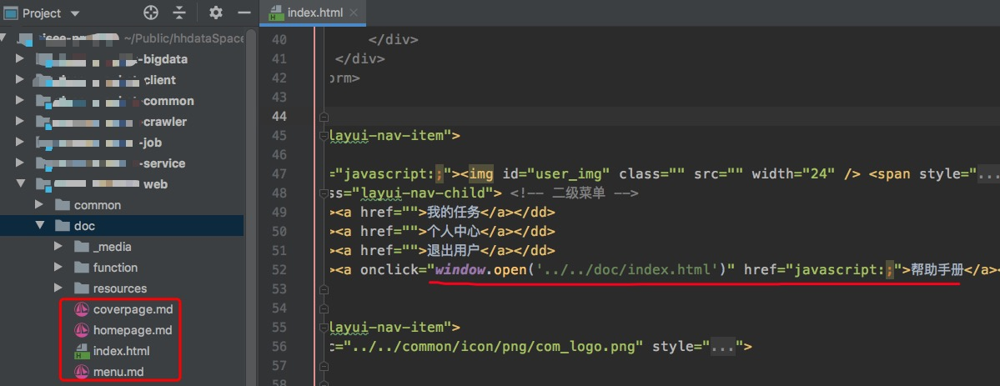

# docsifyDemo
官网地址： https://docsify.js.org/#/zh-cn/  
参考地址： https://segmentfault.com/a/1190000017576714  

**常见问题**
- 换行：在末尾敲两空格。
- 链接不生效，请确保有链接的那行最前面没有空格。
- 进入首页 http://localhost:3000/#/README。
- 不搭建服务也可以，直接下载项目，复制文件夹到自己的项目中，添加一个连接即可。
    

启动本地服务命令 cd docsifyDemo(改成你的文件夹) && python -m SimpleHTTPServer 3000  
  
  

**终极成果**

