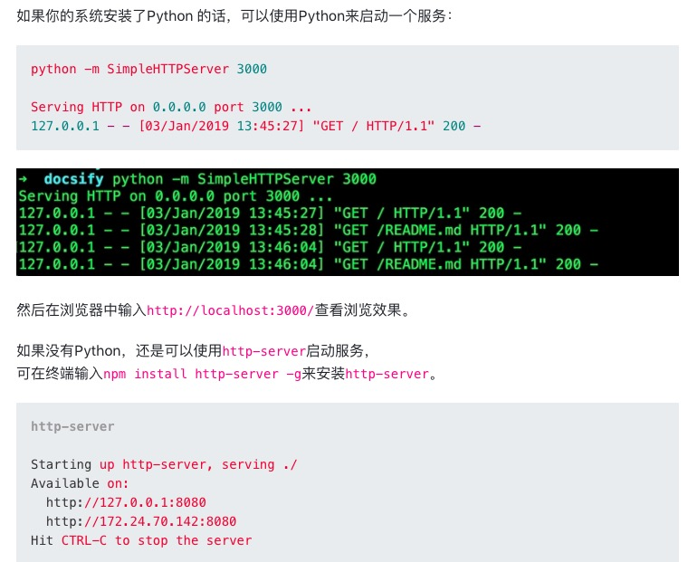
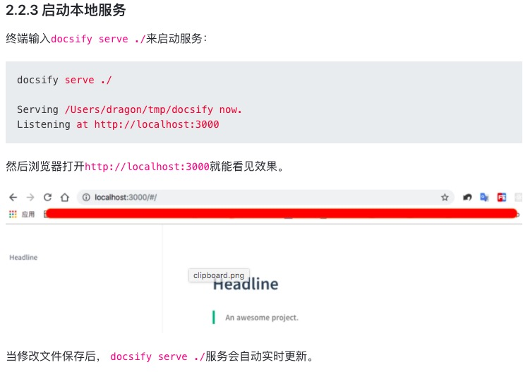
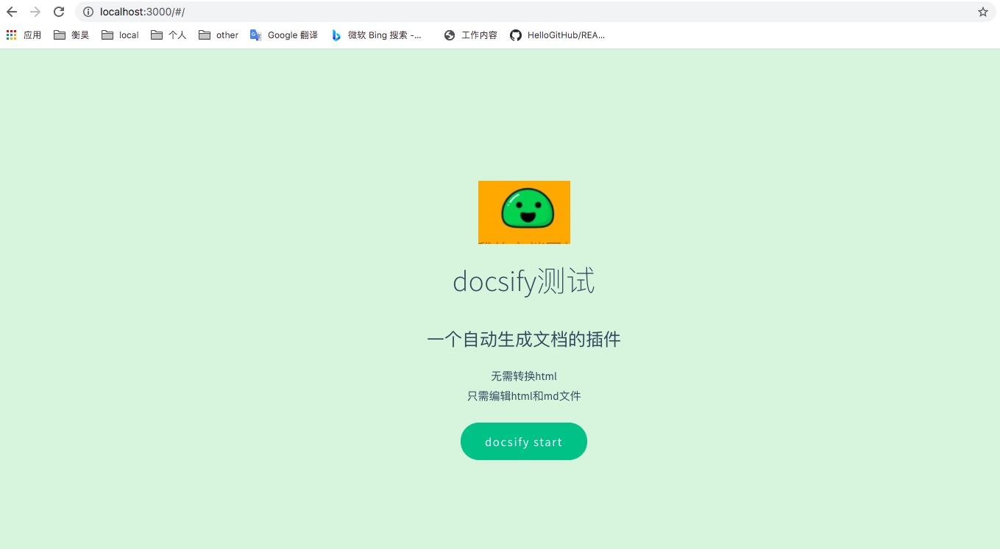
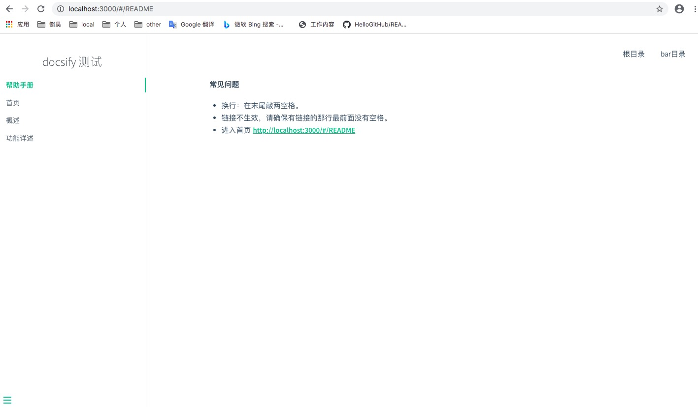

# docsifyDemo
官网地址： https://docsify.js.org/#/zh-cn/  
参考地址： https://segmentfault.com/a/1190000017576714  
启动本地服务命令 cd docs && python -m SimpleHTTPServer 3000  
**常见问题**
- 换行：在末尾敲两空格。
- 链接不生效，请确保有链接的那行最前面没有空格。
- 进入首页 http://localhost:3000/#/README

  
  

**终极成果**

